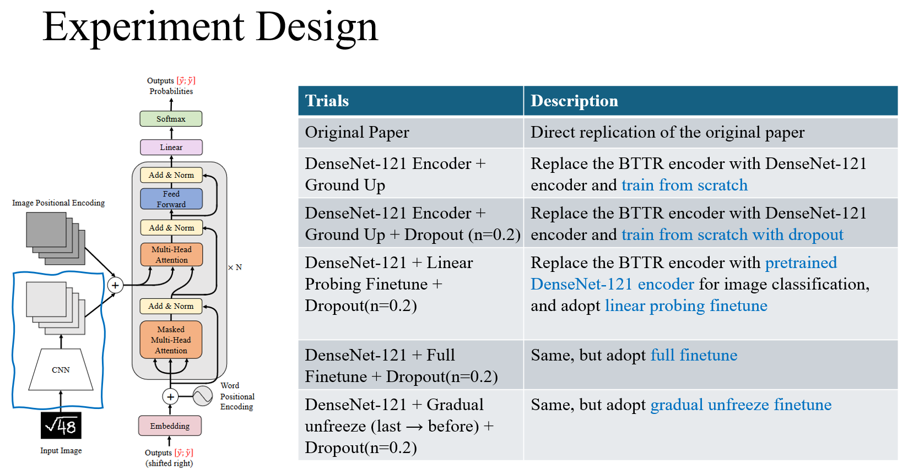
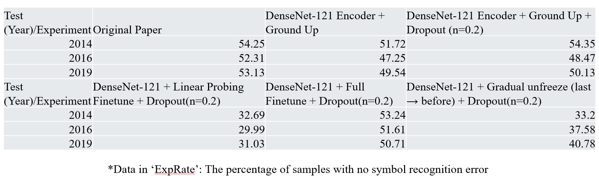

<div align="center">

# Handwritten Mathematical Expression Recognition with Bidirectionally Trained Transformer

[](https://arxiv.org/abs/2105.02412)

[](https://link.springer.com/chapter/10.1007%2F978-3-030-86331-9_37)

</div>

## Description

Convert offline handwritten mathematical expression to LaTeX sequence using bidirectionally trained transformer.   

## How to run

First, install dependencies   

```bash
# clone project   
git clone https://github.com/Green-Wood/BTTR

# install project   
cd BTTR
conda create -y -n bttr python=3.7
conda activate bttr
conda install --yes -c pytorch pytorch=1.7.0 torchvision cudatoolkit=<your-cuda-version>
pip install -e .   
```

 Next, navigate to any file and run it. It may take **6~7** hours to converge on **4** gpus using ddp.

```bash
# module folder
cd BTTR

# train bttr model using 4 gpus and ddp
python train.py --config config.yaml  
```

For single gpu user, you may change the `config.yaml` file to

```yaml
gpus: 1
# gpus: 4
# accelerator: ddp
```

## Imports

This project is setup as a package which means you can now easily import any file into any other file like so:

```python
from bttr.datamodule import CROHMEDatamodule
from bttr import LitBTTR
from pytorch_lightning import Trainer

# model
model = LitBTTR()

# data
dm = CROHMEDatamodule(test_year=test_year)

# train
trainer = Trainer()
trainer.fit(model, datamodule=dm)

# test using the best model!
trainer.test(datamodule=dm)
```

## Note

Metrics used in validation is not accurate.

For more accurate metrics:

1. use `test.py` to generate result.zip
2. download and install [crohmelib](http://saskatoon.cs.rit.edu:10001/root/crohmelib), [lgeval](http://saskatoon.cs.rit.edu:10001/root/lgeval), and [tex2symlg](https://www.cs.rit.edu/~crohme2019/downloads/convert2symLG.zip) tool.
3. convert tex file to symLg file using `tex2symlg` command
4. evaluate two folder using `evaluate` command

### Citation

```
@article{zhao2021handwritten,
  title={Handwritten Mathematical Expression Recognition with Bidirectionally Trained Transformer},
  author={Zhao, Wenqi and Gao, Liangcai and Yan, Zuoyu and Peng, Shuai and Du, Lin and Zhang, Ziyin},
  journal={arXiv preprint arXiv:2105.02412},
  year={2021}
}
```

```
@inproceedings{Zhao2021HandwrittenME,
  title={Handwritten Mathematical Expression Recognition with Bidirectionally Trained Transformer},
  author={Wenqi Zhao and Liangcai Gao and Zuoyu Yan and Shuai Peng and Lin Du and Ziyin Zhang},
  booktitle={ICDAR},
  year={2021}
}
```

## Replication Notes

These are the notes from Haoyuan, Hongyi, and Siyuan, who replicated the project in 2025/2.

The followings are the work that we have done:

1. Modify the code so that it run with the latest versions of PyTorch & PyTorch lightning.
   
   ```bash
   # Now setup the project like this
   # clone project   
   git clone https://github.com/ToothlessOS/BTTR
   
   # install project   
   cd BTTR
   conda create -y -n bttr python=3.10
   conda activate bttr
   
   # Follow the instructions on PyTorch official site
   pip3 install torch torchvision torchaudio --index-url https://download.pytorch.org/whl/cu126
   
   pip install -e .
   ```
   
   ```bash
   # Train
   cd BTTR
   # Change the settings in config.yaml
   python train.py --config config.yaml
   
   # Test
   # If you don't want to use the visualization funcs that we created:
   # Remove the 'callbacks' argument in trainer initialization in test.py
   cd BTTR
   python test.py
   ```

2. Make some tweaks with the encoder part of the network.
   `encoder_mod_densenet_scratch_add_dropout.py`: Replace the original encoder with DenseNet-121 with configurable `drop_rate`
   We also provided three options of finetuning the pretrained DenseNet-121 model on ImageNet:
   
   1. `encoder_mod_densenet_pretrained_add_dropout`: Use linear-probing finetuning.
   
   2. `encoder_mod_densenet_pretrained_full_finetune`: Use full finetuning.
   
   3. `encoder_mod_densenet_pretrained_opti_finetune`: Use gradual unfreeze (last to first) finetuning. This is achieved through the PyTorch-Lightning callback in the `lit_bttr_finetune.py`
      
      ```bash
      # Special instructions for the third option
      cd BTTR
      
      # Train
      python finetune.py --config config_finetune.yaml
      
      # Test
      python finetune_test.py
      ```

3. Results
   The results are as follows. To be honest the results are not that good (lol). A fun practice anyway, isn't it?
   
   
   
    
